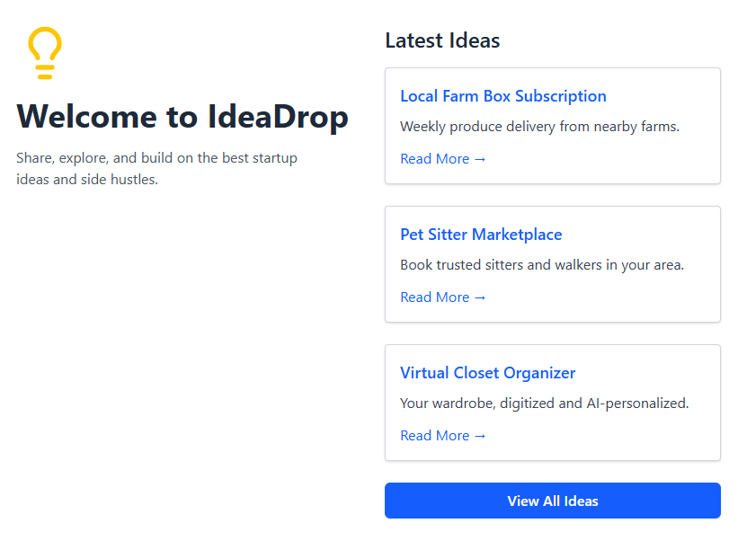

# IdeaDrop 💡

A full-stack MERN application for sharing, exploring, and building on startup ideas and side hustles.

🔗 **Live Demo:** [https://idea-drop.netlify.app](https://idea-drop.netlify.app)



---

## About

IdeaDrop was built as part of Brad Traversy's Modern React course on Udemy. It is a full-stack project covering frontend and backend development, authentication, and cloud deployment.

---

## Tech Stack

**Frontend**

- React 19 with TypeScript
- TanStack Router (file-based routing)
- TanStack Query (data fetching, caching, and mutations)
- Tailwind CSS
- Axios
- Vite
  **Backend**
- Node.js + Express
- MongoDB + Mongoose
- JWT Authentication (access tokens + refresh tokens via httpOnly cookies)
- bcryptjs for password hashing
- jose for JWT signing and verification
  **Deployment**
- Frontend: Netlify
- Backend: Render
- Database: MongoDB Atlas

---

## Features

- Browse all ideas
- View individual idea details
- Create, edit, and delete ideas (authenticated users only)
- User registration and login
- JWT-based authentication with refresh token rotation
- Protected routes

---

## Getting Started

### Prerequisites

- Node.js
- MongoDB Atlas account

### Backend

```bash
cd idea-drop-api
npm install
```

Create a `.env` file:

```env
PORT=8000
MONGO_URI=your_mongodb_connection_string
JWT_SECRET=your_jwt_secret
NODE_ENV=development
```

```bash
npm run dev
```

### Frontend

```bash
cd idea-drop-ui
npm install
```

Create a `.env` file:

```env
VITE_API_URL=http://localhost:8000
```

```bash
npm run dev
```

---

## License

This project was built for educational purposes as part of a Udemy course by [Brad Traversy](https://www.traversymedia.com/).
